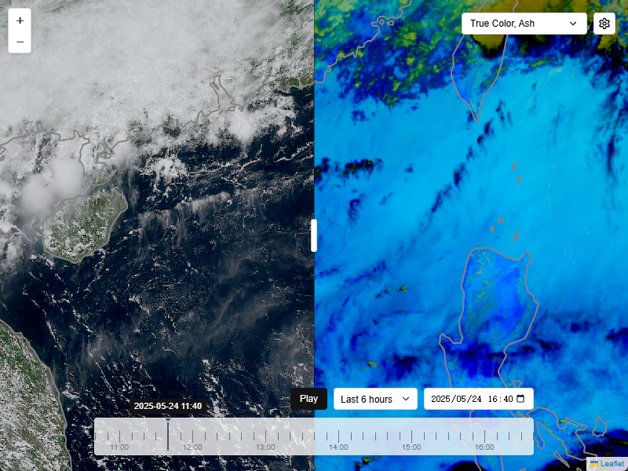

# Twilight - Himawari Satellite Data Visualization System

A real-time satellite data visualization system that processes and displays Himawari-8/9 satellite imagery through an interactive web interface. The system consists of three main components: a React-based frontend application, a Flask backend server, and a Python worker for satellite data processing.



## Project Overview

This system provides real-time visualization of Himawari-8/9 satellite data with the following capabilities:

- **Real-time Data Processing**: Automatically downloads and processes Himawari-8/9 satellite data from NOAA S3 buckets
- **Interactive Web Interface**: React-based frontend with Leaflet maps for satellite imagery visualization
- **Multiple Composite Types**: Support for various satellite composites (True Color, IR Clouds, Ash, Night Microphysics etc.)
- **Time-based Navigation**: Browse satellite imagery across different time periods
- **Side-by-side Comparison**: Compare two different satellite composites simultaneously
- **Task-based Architecture**: Distributed processing system with priority-based task management

## Architecture

```
┌─────────────────┐    ┌─────────────────┐    ┌─────────────────┐
│                 │    │                 │    │                 │
│   Client        │◄──►│   Server        │◄──►│   Worker        │
│   (React/TS)    │    │   (Flask)       │    │   (Python)      │
│                 │    │                 │    │                 │
└─────────────────┘    └─────────────────┘    └─────────────────┘
        │                       │                       │
        │                       │                       │
        ▼                       ▼                       ▼
┌─────────────────┐    ┌─────────────────┐    ┌─────────────────┐
│   Web Browser   │    │   MinIO/S3      │    │   NOAA S3       │
│ (User Interface)│    │   (Tile Storage)│    │   (Raw Data)    │
└─────────────────┘    └─────────────────┘    └─────────────────┘
```

## Project Structure

### `/client` - Frontend Application

React-based web application built with TypeScript and Vite.

**Key Features:**

- Interactive map interface using Leaflet and React-Leaflet
- Real-time satellite imagery display with time-based navigation
- Multi-composite selection and side-by-side comparison
- Responsive design for desktop and mobile devices
- Settings management for API configuration

**Main Components:**

- `app.tsx` - Main application component with map container
- `components/` - Reusable UI components
  - `time-range-selector.tsx` - Time navigation controls
  - `multi-select-composite.tsx` - Composite type selector
  - `side-by-side.tsx` - Split-screen comparison tool
  - `settings-button.tsx` - Configuration interface
- `utils/api-client.ts` - API communication layer
- `utils/types.ts` - TypeScript type definitions

**Technologies:**

- React 18 with TypeScript
- Leaflet for interactive maps
- Vite for build tooling
- Day.js for time manipulation
- Ky for HTTP requests

### `/server` - Backend Server

Flask-based REST API server that serves satellite tile data and manages processing tasks.

**Key Features:**

- Tile server with time-based URL patterns (`/{composite}/tiles/{time}/{z}/{x}/{y}.png`)
- TileJSON endpoint for map configuration
- Task management API for distributed processing
- Flask-Caching for performance optimization
- MinIO integration for tile storage

**Main Components:**

- `app.py` - Main Flask application with tile serving and task management
- `config.py` - Configuration settings for MinIO and other services

**API Endpoints:**

- `GET /{composite}/tiles/{time}/{z}/{x}/{y}.png` - Tile serving with ISO 8601 time format
- `GET /{composite}.tilejson` - TileJSON metadata for map configuration
- `GET /composites/latest` - Latest available timestamps for all composites
- `POST /api/tasks` - Create new processing tasks
- `GET /api/tasks` - List and filter tasks
- `PUT /api/tasks/{task_id}` - Update task status

**Technologies:**

- Flask web framework
- Flask-Caching for memory-based caching
- Rio-Tiler for raster tile generation
- MinIO client for object storage
- Threading for concurrent task management

### `/worker` - Satellite Data Processor

Python worker system for downloading, processing, and uploading Himawari satellite data.

**Key Features:**

- Automatic monitoring of NOAA Himawari S3 buckets
- Multi-composite processing (True Color, IR Clouds, Ash, Night Microphysics etc.)
- Task-based architecture with priority management
- Distributed processing across multiple machines
- Real-time status reporting to backend server

**Main Components:**

- `main.py` - Entry point with task generator and worker management
- `himawari_processor.py` - Core satellite data processing logic
- `task_manager.py` - Task queue management and server communication
- `utils.py` - Utility functions and logging configuration

**Processing Pipeline:**

1. **Data Monitoring**: Continuously checks NOAA S3 for new Himawari data (160 files per 10-minute interval)
2. **Data Download**: Downloads HSD format files from S3 when complete datasets are available
3. **Composite Generation**: Uses SatPy to generate various satellite composites
4. **Tile Generation**: Converts composites to Cloud Optimized GeoTIFF (COG) format
5. **Upload**: Stores processed tiles in MinIO for serving by the backend

**Technologies:**

- SatPy for satellite data processing
- S3FS for AWS S3 access
- Rasterio for raster data manipulation
- MinIO client for tile storage
- Threading for concurrent processing

## Installation and Setup

### Prerequisites

- Python 3.12
- Node.js 18+
- MinIO server (for tile storage)

### Backend Setup

```bash
# Install Python dependencies using PDM
pdm install

# Copy and configure settings
cp config.sample.py config.py
# Edit config.py with your MinIO credentials

# Run the server
python app.py
```

### Client Setup

```bash
# Install Node.js dependencies
npm install

# Start development server
npm run dev

# Build for production
npm run build
```

### Worker Setup

```bash
# Install Python dependencies using PDM
pdm install

# Copy and configure settings
cp config.sample.py config.py
# Edit config.py with your MinIO and server settings

# Run worker in hybrid mode (monitor + worker)
python main.py --mode hybrid --server-url http://localhost:5000

# Run worker in worker-only mode
python main.py --mode worker --server-url http://localhost:5000
```

## Configuration

### MinIO Setup

The system requires MinIO for tile storage. Configure the connection in both `server/config.py` and `worker/config.py`:

```python
endpoint = "your-minio-endpoint:9000"
access_key = "your-access-key"
secret_key = "your-secret-key"
```

### Client Configuration

The client can be configured through the settings interface or by modifying localStorage:

```javascript
localStorage.setItem("endpoint", "http://localhost:5000");
localStorage.setItem("token", "your-api-token");
```

## Usage

### Starting the System

1. Start MinIO server
2. Start the Flask backend server
3. Start one or more worker processes
4. Start the client development server or serve the built application

### Accessing the Interface

- Open your web browser to `http://localhost:5173` (development) or your deployed URL
- Select satellite composites from the dropdown menu
- Use the time selector to navigate through available imagery
- Enable side-by-side comparison by selecting two composites

### Processing Modes

The worker supports two operational modes:

- **Hybrid Mode** (`--mode hybrid`): Monitors for new data and processes tasks
- **Worker Mode** (`--mode worker`): Only processes existing tasks from the queue

## API Reference

### Tile Endpoints

- `GET /{composite}/tiles/{time}/{z}/{x}/{y}.png`
  - Returns PNG tile for specified composite, time, and tile coordinates
  - Time format: ISO 8601 (e.g., `2025-04-20T04:00:00`)

### Data Endpoints

- `GET /composites/latest` - Returns latest timestamps for all composites
- `GET /{composite}.tilejson` - Returns TileJSON metadata

### Task Management

- `POST /api/tasks` - Create new processing task
- `GET /api/tasks` - List tasks with optional filtering
- `PUT /api/tasks/{task_id}` - Update task status

## Development

### Client Development

```bash
npm run dev     # Start development server
npm run build   # Build for production
npm run lint    # Run ESLint
```

### Backend Development

```bash
python app.py   # Start Flask development server
```

### Worker Development

```bash
python main.py --mode hybrid  # Start in development mode
```

## Contributing

1. Fork the repository
2. Create a feature branch
3. Make your changes
4. Add tests if applicable
5. Submit a pull request

## License

This project is licensed under the MIT License - see the LICENSE file for details.
