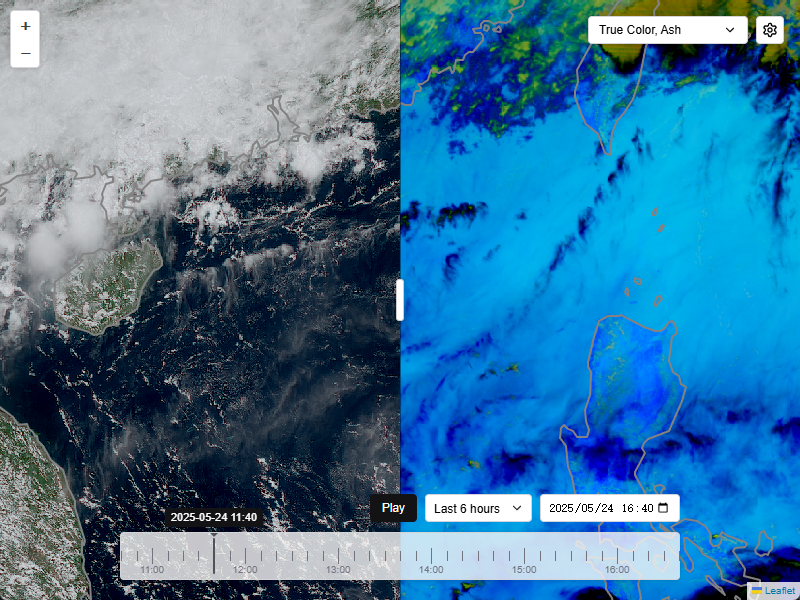

# Twilight - A Himawari Satellite Data Visualization System

A real-time satellite data visualization system that processes and displays Himawari-8/9 satellite imagery through an interactive web interface.



## Documentation

For detailed installation guides, configuration, and API reference, please see our [Full Documentation](docs/index.rst).

- [Architecture](docs/introduction/architecture.rst)
- [Deployment](docs/deployment/deployment.rst)
- [Satellite Composites](docs/guide/composites.rst)
- [API Reference](docs/api/overview.rst)

## Available Composite Types

Twilight supports ten satellite composites out of the box:

- `true_color` - Natural-color view using visible red, green, and blue bands.
- `ir_clouds` - Infrared cloud-top temperature.
- `ash` - Volcanic ash detection using thermal infrared differences.
- `airmass` - Upper-tropospheric air mass analysis.
- `day_microphysics` - Daytime cloud microphysics (particle size and phase).
- `night_microphysics` - Nighttime cloud microphysics using infrared bands.
- `fog` - Low-level fog and stratus detection.
- `convection` - Deep convection and overshooting tops.
- `vapor` - Differential water vapor analysis distinguishing between upper and mid-level humidity layers.

## Quick Start

1. **Configure environment**:

   ```bash
   cp .env.sample .env
   ```

2. **Start core services** (Infrastructure, API & Frontend):

   ```bash
   docker compose up -d
   ```

3. **Start processing workers**:

   ```bash
   docker compose -f docker-compose.workers.yml up -d
   ```

4. **Access the interface**:
   Open `http://localhost` in your browser.

## Processing Modes

The worker system supports multiple operational modes via command-line flags (configured in the Docker Compose environment):

- **Task Generation** (`--task`): Monitors NOAA S3 for new data and enqueues processing tasks.
- **Data Synchronization** (`--sync`): Downloads raw HSD files from NOAA S3 to local MinIO storage.
- **Composite Worker** (`--worker`): Picks tasks from the queue, generates composites, and uploads tiles.

## Project Structure

Twilight is composed of three primary services:

- **[`/client`](client/)**: React-based frontend application built with TypeScript and Vite.
- **[`/server`](server/)**: Flask-based REST API serving satellite tiles and managing tasks.
- **[`/worker`](worker/)**: Python processing nodes that monitor S3, sync data, and generate composites.
- **[`/docs`](docs/)**: Sphinx-based documentation source files.

## Development

If you wish to run components individually for development:

### Backend & Infrastructure

```bash
# Start Redis and MinIO only
docker compose up -d redis minio

# Run Flask server
cd server && uv run python app.py
```

### Frontend

```bash
cd client && npm install && npm run dev
```

### Worker

```bash
cd worker && uv run python main.py --task --sync --worker
```

## Testing

```bash
# Run all tests
uv run pytest

# Build documentation
just docs
```

## License

This project is licensed under the MIT License - see the LICENSE file for details.
